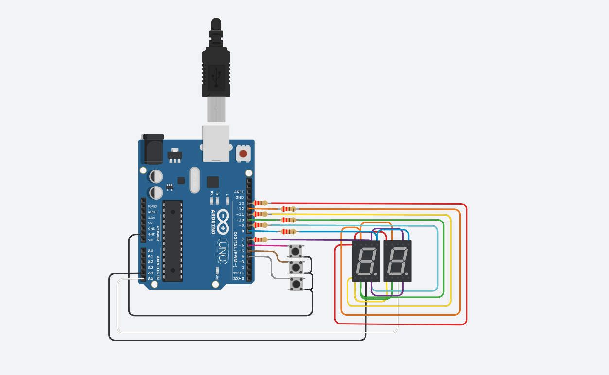
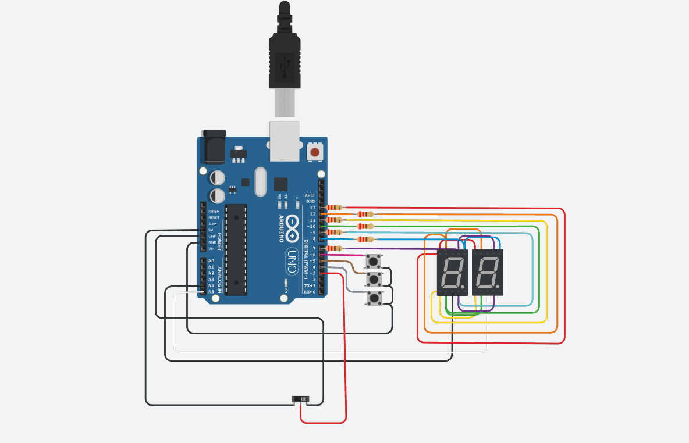
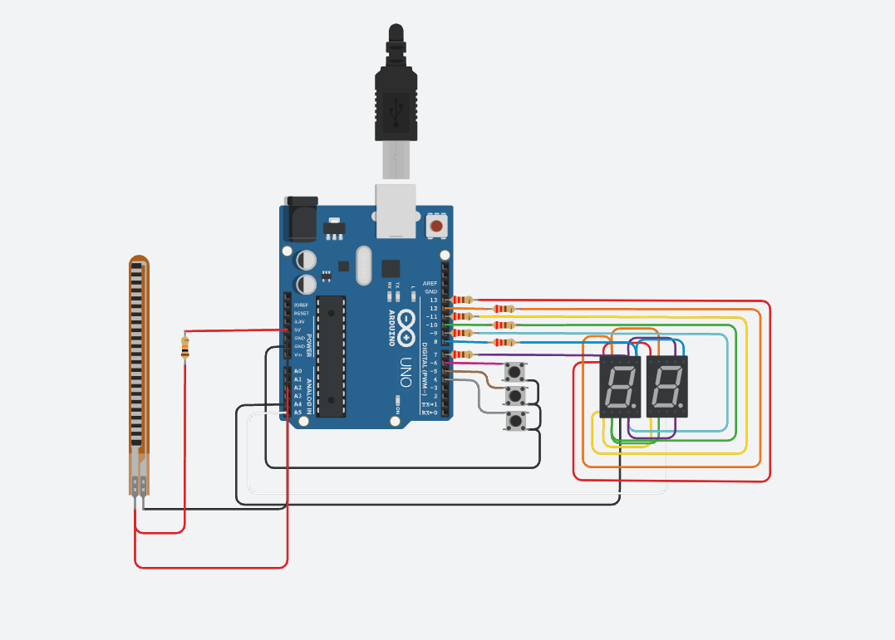

# Ejemplo Documentación 

## Integrantes 
- Nicolas Caliari
- Tobias Pasinato
- Luciano javier Lucero

## Proyecto: Contador binario.

## Descripción
Primera parte: Se encarga de sumar, restar y resetear un contador. Sumando de a uno al contador o restando de a uno y en el caso de resetar reinicia a cero el contador.

Segunda parte: Cumple la misma funcion que en la parte uno, ademas que mediante un switch podes cambiar de modo, a contador o muestra los numeros primos.

Tercera parte: Cumple la misma funcion que la parte dos, solo que cambiamos el swtich por un sensor de flexibilidad.

## investigacion de motor cc
MOTOR CC
Un motor de corriente continua (CC) es una máquina giratoria que convierte energía eléctrica en energía mecánica. Esta funcionalidad está basada en el principio de inducción, bajo el cual se crea una fuerza electromagnética a partir de una corriente de entrada que, a la vez, crea un movimiento giratorio.
El motor de corriente continua se clasifica en dos tipos, es decir, el motor de excitación independiente y el motor autoexcitación.
Un motor de corriente continua se compone principalmente de dos partes: El estátor (carcasa exterior) crea un campo magnético. El rotor es la parte interior que gira, alimentado con corriente directa a través de delgas, que están en contacto alternante con escobillas fijas.
La eficiencia de un motor de CC es la relación entre la potencia de entrada y la potencia de salida medida en vatios. Muchas de las piezas y partes del motor influyen (reduciendo el impacto) en la eficiencia del motor, teniendo como resultado el calor generado. Esto también es aplicable a temperaturas muy altas o bajas del entorno inmediato, las cuales a menudo forman parte de los entornos de trabajo de los actuadores industriales.
No obstante, existen maneras de garantizar la alta eficiencia de un motor en el caso de los motores de CC en general.
Con el fin de conseguir un rendimiento óptimo del motor, necesitará un suministro estable de alimentación y deberá asegurarse de que el cableado y la tensión de entrada son los correctos, ya que son igualmente importantes a la hora de obtener la mayor eficiencia posible.

## Función principal
Esta funcion se encarga de encender y apagar los displays.

A, B, C, D, E ,F ,G son #define que utilizamos para prender los leds del displays, asociandolo a pines de la placa arduino.

(Breve explicación de la función)

~~~ C (lenguaje en el que esta escrito)
void prendeUnNumero(int digit)
{
  digitalWrite(A, LOW);
  digitalWrite(B, LOW);
  digitalWrite(C, LOW);
  digitalWrite(D, LOW);
  digitalWrite(E, LOW);
  digitalWrite(F, LOW);
  digitalWrite(G, LOW);
  switch (digit)
  {
    case 1:
    {
      digitalWrite(B, HIGH);
      digitalWrite(C, HIGH);
      break;
    }
    case 2:
    {
      digitalWrite(A, HIGH);
      digitalWrite(B, HIGH);
      digitalWrite(D, HIGH);
      digitalWrite(E, HIGH);
      digitalWrite(G, HIGH);
      break;
    }

    case 3:
    {
      digitalWrite(A, HIGH);
      digitalWrite(B, HIGH);
      digitalWrite(C, HIGH);
      digitalWrite(D, HIGH);
      digitalWrite(G, HIGH);
      break;
    }
    case 4:
    {
      digitalWrite(B, HIGH);
      digitalWrite(C, HIGH);
      digitalWrite(F, HIGH);
      digitalWrite(G, HIGH);
      break;
    }

    case 5:
    {
      digitalWrite(A, HIGH);
      digitalWrite(C, HIGH);
      digitalWrite(D, HIGH);
      digitalWrite(F, HIGH);
      digitalWrite(G, HIGH);
      break;
    }
    case 6:
    {
      digitalWrite(A, HIGH);
      digitalWrite(C, HIGH);
      digitalWrite(D, HIGH);
      digitalWrite(E, HIGH);
      digitalWrite(F, HIGH);
      digitalWrite(G, HIGH);
      break;
    }

    case 7:
    {
      digitalWrite(A, HIGH);
      digitalWrite(B, HIGH);
      digitalWrite(C, HIGH);
      break;
    }
    case 8:
    {
      digitalWrite(A, HIGH);
      digitalWrite(B, HIGH);
      digitalWrite(C, HIGH);
      digitalWrite(D, HIGH);
      digitalWrite(E, HIGH);
      digitalWrite(F, HIGH);
      digitalWrite(G, HIGH);
      break;
    } 
    case 9:
    {
      digitalWrite(A, HIGH);
      digitalWrite(B, HIGH);
      digitalWrite(C, HIGH);
      digitalWrite(D, HIGH);
      digitalWrite(F, HIGH);
      digitalWrite(G, HIGH);
      break;
    } 

    case 0:
    {
      digitalWrite(A, HIGH);
      digitalWrite(B, HIGH);
      digitalWrite(C, HIGH);
      digitalWrite(D, HIGH);
      digitalWrite(E, HIGH);
      digitalWrite(F, HIGH);
      break;
    }
  }
}

~~~

## :robot: Links del proyecto
- [proyecto parte 1](https://www.tinkercad.com/things/8yg0p5JViK7-tp1-parte-1/editel)
- [proyecto parte 2](https://www.tinkercad.com/things/4Iubwx2xzL8-tp1/editel)
- [proyecto parte 2 sensor](https://www.tinkercad.com/things/6Vz955WHeC8-copy-of-tp1/editel?tenant=circuits)

